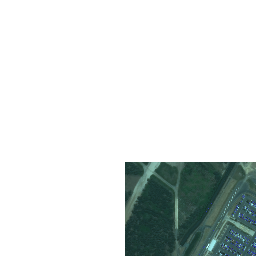
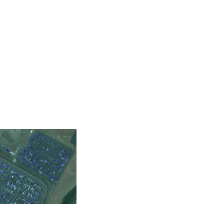
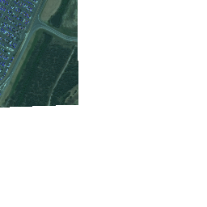
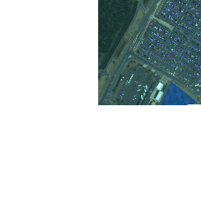

# Space Eye

### Description
Script that uses `asyncio` and https://docs.spaceknow.com/ APIs to localize and count number of cars on the map extent defined by geojson polygon.

### Usage

requires Python 3.7.0 or higher

```
pip install -r requirements.txt

python space_car/main.py <path-to-geojson>

```
#### Env vars
JWT_TOKEN - needs to be set to valid spaceknow.com token.
#### Output
Images and count stats will be saved into output folder.

### Preview

#### Output For Staff Parking Lot of Brisbane Airport, Australia





